  

*From luxury hospitality to the terminal — I spent almost ten years crafting experiences for Dior and LVMH across Paris, Sydney and Tokyo. Now I build them in React.*

 

 

## About

- 🎓 Fullstack web development student @ **EPITECH Web@cadémie** (Paris, promo 2027)
- 🔍 Looking for a **ONE-YEAR ALTERNANCE STARTING SEPTEMBER 2026** 
- 🎨 Design-minded developer — I care as much about the pixel as the query behind it
- 🌱 Currently deepening **TypeScript** and **Next.js**

## Stack

     
     

## Selected work

| Project | What it is | Built with |
|---|---|---|
| **CoreLab** | LMS for French middle-school students — frontend architecture, auth context, role-based routing, full design system | MERN, Tailwind v4 |
| **Connect'In** | Internal social network — full UX/UI ownership from Figma to production | Laravel, React |
| **Persona** | AI chatbot aggregating personalized news into newsletters, session-based auth, local LLM | n8n, Ollama, qwen2.5 |
| **LearnSphere** | Fashion e-learning platform with custom plugin (shortcodes, taxonomies) | WordPress, PHP |
| **Portfolio** | This one is best experienced [live](https://remadetheproject.com) | React, Tailwind v4, motion |

## Beyond the code

Certified Ikebana Practitioner (Sôgetsu School) · Photography · Specialty Coffee — hence the handle ☕

 

— crafted with the same care as a good pour-over —

<!--
**Caffeinegal/Caffeinegal** is a ✨ _special_ ✨ repository because its `README.md` (this file) appears on your GitHub profile.

Here are some ideas to get you started:

- 🔭 I’m currently working on ...
- 🌱 I’m currently learning ...
- 👯 I’m looking to collaborate on ...
- 🤔 I’m looking for help with ...
- 💬 Ask me about ...
- 📫 How to reach me: ...
- 😄 Pronouns: ...
- ⚡ Fun fact: ...
-->
